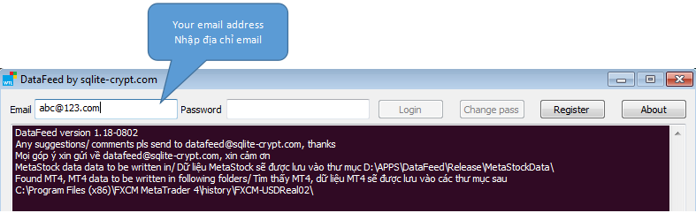

### **Dữ liệu chứng khoán, phái sinh intraday cho Amibroker, MT4, MetaStock**
*Đây là tài liệu hướng dẫn sử dụng cho [DataFeed Tool](https://datafeed.sqlite-crypt.com), công cụ cung cấp dữ liệu chứng khoán và phái sinh AmiBroker, MT4 và MetaStock miễn phí suốt đời và cực nhanh ngay trong phiên.*

#### **Yêu cầu hệ thống**
DataFeed Tool yêu cầu Windows XP hoặc cao hơn (Windows XP/ Windows Server 2003/ Windows Vista/ Windows 7/ Windows 8/ Windows 8.1/ Windows 10/ Windows 11).

Bộ nhớ: 8MB (MB chứ không phải GB nhé, chỉ có các máy tính từ thời Bill Gates còn cởi truồng mới không đủ bộ nhớ để chạy!)

Đĩa cứng: Phần mềm cần 1MB và dữ liệu cần khoảng 100MB mỗi năm.

Với những yêu cầu hết sức khiêm tốn như thế này thì bất cứ máy tính Windows nào cũng được các bạn nhé, kể cả máy đồ cổ vẫn chạy tốt. 

#### **Hướng dẫn sử dụng**
Tải và giải nén [DataFeed Tool](https://datafeed.sqlite-crypt.com/home/_try/files/DataFeedTool.zip), tốt nhất tránh các thư mục hệ thống trong ổ C (Program Files, Windows ...) vì có thể có vấn đề với quyền ghi dữ liệu trên máy với Windows 8 trở lên. **Lưu ý, tool sử dụng cổng 3366 nên bạn phải mở cổng này nếu có firewall. Nếu bạn sử dụng mạng ở công ty có thể sẽ không truy cập được, khi đó bạn cần chuyển sang dùng 4G.**
###### Đăng ký tài khoản
Nhập địa chỉ email rồi bấm nút **Register**, hệ thống sẽ gửi mật khẩu đăng nhập về địa chỉ email. Vui lòng sử dụng địa chỉ email có thực để đăng ký vì hệ thống sẽ gửi mật khẩu về email của bạn, nhớ kiểm tra cả thư mục spam các bạn nhé, mail có thể lọt vào đó. Trong trường hợp không nhận được email, vui lòng liên hệ với chúng tôi qua email hoặc Skype để được hỗ trợ.

###### Đăng nhập
Nhập email và mật khẩu đã nhận được trong bước đăng ký ở trên và bấm nút **Login**. Sau khi đăng nhập thành công DataFeed Tool sẽ tải về dữ liệu quá khứ, đồng thời tạo dữ liệu MetaStock trong thư mục **MetaStockData** (cùng thư mục với DataFeed.exe). DataFeed sẽ quét tự động máy tính của bạn để tìm các phiên bản MetaTrader (MT4) đã cài đặt và tạo dữ liệu lịch sử MT4 trong các thư mục history của MT4. Nếu bạn có nhiều phiên bản MT4 (các công ty forex khác nhau) và có nhiều tài khoản, dữ liệu sẽ được tạo trong tất cả các thư mục history tìm được.
_Lưu ý_: Nếu không muốn DataFeed tự tìm thư mục dữ liệu lịch sử MT4, bạn có thể tạo tệp _datafeed.mt4.cfg_, ghi thư mục history của MT4 vào đó và lưu lại.
###### Nếu bạn dùng MetaStock
Để dùng được chart intraday với MetaStock, bạn cần bản Professional (ví dụ bản MetaStock Professional 11), vì bản thường không hỗ trợ dữ liệu intraday. Chạy MetaStock Professional Offline Mode, chọn File/ Open và trỏ vào thư mục **MetaStockData** trong thư mục DataFeed. Do đây là chế độ offline, chart sẽ ko được làm mới tự động. Bạn có thể dùng [MetaStockRefresher](https://datafeed.sqlite-crypt.com/home/_try/files/MetaStockRefresher.zip) để làm mới chart tự động. _Lưu ý_: Chỉ dùng lựa chọn "Only active chart" của MetaStockRefresher vì lựa chọn "All charts" hay bị lỗi.
###### Nếu bạn dùng AmiBroker
MetaStock data plugin của AmiBroker hay chạy bị lỗi với nếu số mã lớn hơn 255, vì vậy chúng tôi khuyến nghị sử dụng [plugin này](https://datafeed.sqlite-crypt.com/home/_try/files/datafet.zip) (hoặc [bản 64-bit](https://datafeed.sqlite-crypt.com/home/_try/files/datafet64.zip) nếu AmiBroker của bạn là bản 64-bit). Chỉ cần chép tệp dll vào C:\Program Files (x86)\AmiBroker\Plugins hoặc C:\Program Files\AmiBroker\Plugins (cho bản 64-bit).
###### Nếu bạn dùng MT4
Để xem chart bằng MT4, chọn File/ Open Offline, rồi chọn mã bạn muốn. Bạn có thể tải indicator [Period_Converter_OptMOD](https://datafeed.sqlite-crypt.com/home/_try/files/Period_Converter_OptMOD.zip), giải nén và chép tệp mq4 vào thư mục Indicators của MT4 (ví dụ C:\Program Files (x86)\FXCM MetaTrader 4\MQL4\Indicators). Thêm indicator này vào chart để tạo dữ liệu với các khung thời gian khác (ví dụ H1), và tự động làm mới chart.

Vui lòng tham khảo video hướng dẫn sử dụng dưới đây:

<iframe width="560" height="315" src="https://www.youtube.com/embed/JDRpossykEM" frameborder="0" allow="autoplay; encrypted-media" allowfullscreen></iframe>

